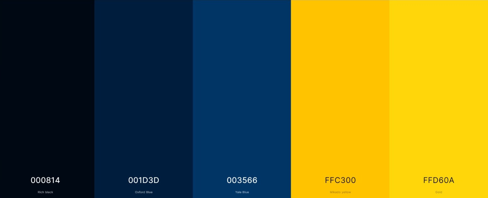
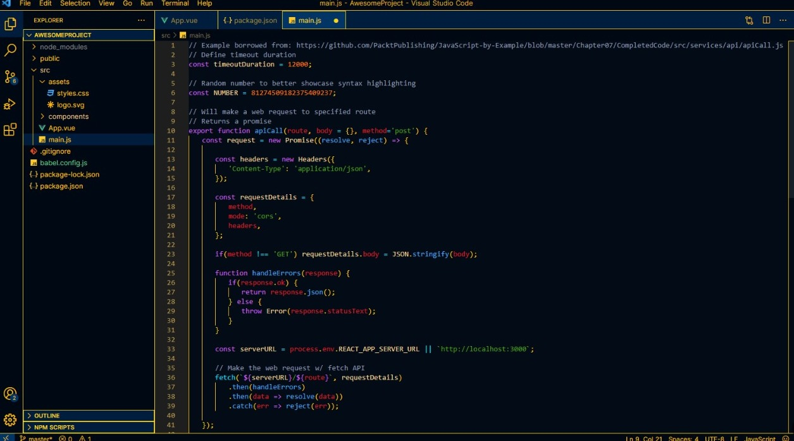
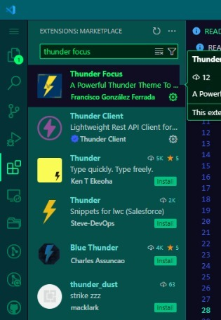

# Thunder Focus

Thunder Focus is a [Visual Studio Code](https://code.visualstudio.com) theme designed for focus. Due to its color palette it is perfect for those dark nights.

## Color Palette

The color main color palette is very simple. It's composed of 3 tones of blue and 3 tones of yellow as shown bellow:

The syntax palette is composed by the following colors:

* Variables and Properties 

* Keywords 

* Numbers 

* Classes and Constants 

* Strings 

* Operators and Special Functions 

* Comments 

The installation method is very simple:

1. Install Visual Studio Code
2. Launch Visual Studio Code
3. Choose Extensions from menu

4. Search for "Thunder Focus"

5. Click Install to install it
6. From the menu bar click: Code > Preferences > Color Theme > Thunder Focus

 

**Happy Coding!** 
